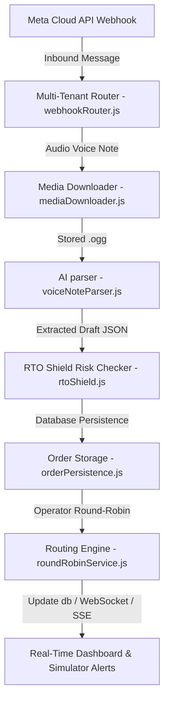

# 🌸 Zanji — WhatsApp-First Social Commerce Platform

Zanji is a multi-tenant, zero-dependency Node.js WhatsApp-first social commerce operating system built to enable micro-merchants in emerging markets (Pakistan, UAE, Indonesia, Nigeria) to run their entire e-commerce pipeline directly inside WhatsApp.

---

## 🚀 Key Features

### 🎙️ Multimodal Voice-to-Order AI Pipeline
- **Urdu & Regional Speech Extraction**: Translates and parses incoming customer voice recordings (common in Pakistan and Indonesia) into structured e-commerce JSON objects using **Gemini 2.5 Flash**.
- **Automated Invoice Drafts**: Generates checkout drafts showing products, quantities, prices, and shipping addresses, requiring only a single click to approve.

### 🛡️ Antigravity RTO Shield (Risk Engine)
- **RTO Protection**: Evaluates historical customer returned orders (RTOs) across cross-tenant metrics.
- **Dynamic Risk Categorization**: Flags orders as `Green`, `Yellow`, or `Red`.
- **Mitigation Prompts**: High-risk (`Red`) customers automatically receive a WhatsApp message prompting them for pre-payment or an exact GPS Pin confirmation.

### 🤝 Multi-Tenant Round-Robin Operator Routing
- **Workload Balancer**: Seqentially routes incoming threads to online team operators (`is_online = true`) based on active load in the last 24 hours.
- **Tie-Breaker Priority**: Accounts with equal active load are prioritized by their creation date (`created_at ASC`).
- **Database Mapping**: Updates order ownership records directly on the database.

### 📢 CTWA Ad Lead Capture
- **Referral Ingestion**: Extracts Meta ad metadata (ad campaign, ID, headline, body, thumbnails, coupon vouchers) from webhook references.
- **Visual Referral Cards**: Displays glowing linear-gradient banners inside the merchant inbox showing exactly which ad campaign brought the customer.

---

## 🏗️ Technical Architecture



---

## 🛠️ Getting Started

### 1. Prerequisites
Ensure you have **Node.js (v18+)** installed.

### 2. Installation
Install project dependencies (zero external runtime frameworks like Express are used, utilizing native Node.js HTTP servers):
```bash
npm install
```

### 3. Running the Server
Run the multi-tenant webhook server (uses Port `3000` by default):
```bash
npm start
```

### 4. Running the Dashboard
Run a local static file server to launch the operator dashboard and customer storefront (uses Port `8000` by default):
```bash
# Using Python
python -m http.server 8000
```
Open `http://localhost:8000` in your web browser.

---

## 🧪 Simulation & Testing Suite

Zanji includes automated test suites to simulate the entire WhatsApp lifecycle locally without live Meta credentials:

### ⚡ Test 1: Operator Round-Robin Unit Tests
Runs isolated scenario checks testing priority routing, workload balancing, and multi-tenant isolation:
```bash
node test_round_robin.js
```

### 🎙️ Test 2: Voice Note Webhook Simulation
Simulates an incoming Meta voice note payload, running the complete pipeline from download, AI extraction, RTO checking, operator assignment, and WebSocket broadcasting:
```bash
node test_meta_simulator.js
```

### 🌐 Test 3: Multi-Tenant Route Gateway Tests
Validates webhook verify tokens, verify handshakes, and multi-phone-number isolation checks:
```bash
node test_multitenant.js
```
